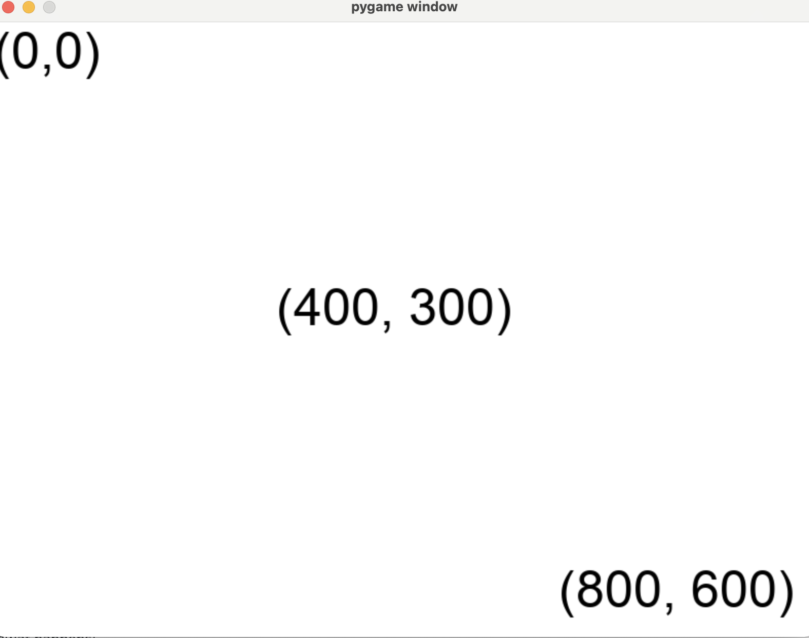

.. _help:

=========
More Help
=========

Help! My DesignerObjects aren't showing up where I want them to.
----------------------------------------------------------------

The Designer window works on a x,y coordinate system where (0, 0) is the left top corner.

Let's look at an example. Say we have a window that is 800 pixels wide and 600 pixels tall (this is
the default size of the Designer window). Look at the image to understand the coordinate system.

        in the bottom corner.

Actions After Start
-------------------

Once you call the `start()` function, no other code will run until your game finishes.

.. code-block:: python

    from designer import *

    # These print statements demonstrate when code runs relative to start
    print("This line will execute before the game starts.")
    start()
    print("This line will not execute until the game is over."

If you want to have activity in your game, you have to use the `when` function to add
event handling.

Why Use a Constructor
---------------------

We recommend having a nullary constructor to set up your World.

.. code-block:: python

    from designer import *

    # Define the shape of the World
    World = { "box": DesignerObject }

    # Create a function that creates new worlds
    def create_the_world() -> World:
        # Actually create an initial World instance
        return {
            # The world has a 20x30 black rectangle in it
            "box": rectangle("black", 20, 30)
        }

    # This tells Designer to call our `create_the_world` function
    # when the game starts, in order to setup our initial World.
    when("starting", create_the_world)

    start()

However, strictly speaking, this isn't necesary. You can actually just create
a World and pass it in to the :code:`start` function.

.. code-block:: python

    from designer import *

    start({"box": rectangle("black", 20, 30)})

The end result is the same, and the version without the constructor seems much
shorter. So why would you want to go through all the trouble?

There are three main advantages to the Constructor approach.

First, we can define the type more concretely. This makes it clearer to others
what the World looks like and how it should be used. Technically, you can also
achieve this if you store the World in a variable.

.. code-block:: python

    from designer import *

    World = { "box": DesignerObject }
    initial_world: World = {"box": rectangle("black", 20, 30)}
    start(initial_world)

Second, we can reset the game more easily. Whenever you want to reset the
game to its initial state, you can simply have an updating function call
the :code:`create_the_world` function and return the resulting new world.

Third, we can test our game more easily. Any time you want to create a World,
you just call :code:`create_the_world` and you have a fresh instance. From there,
you can manipulate its fields and call update functions on the World.